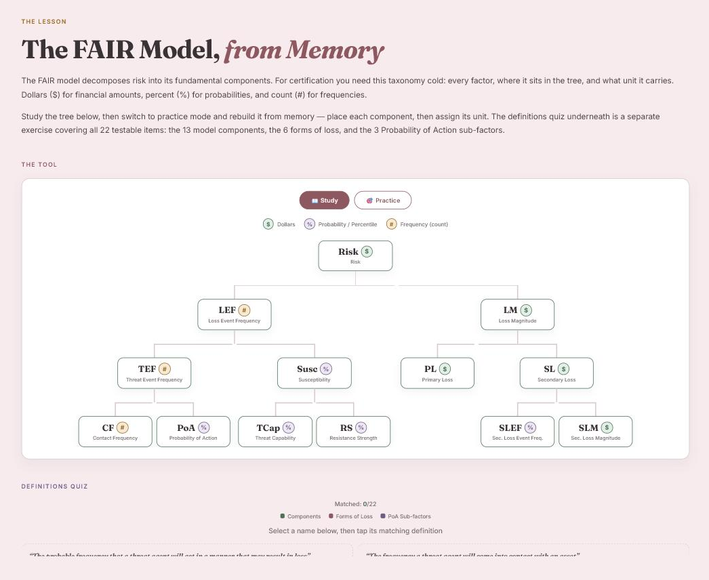

# FAIR Model Study Tool

An interactive drill for the FAIR risk taxonomy: study the decomposition tree, then rebuild it
from memory — place all 13 components in the right positions, assign the right unit to each one,
and match all 22 testable definitions.

**Live:** https://xnasusx.github.io/fair-model-study/



## What it does

- **Study mode** — the complete FAIR decomposition tree, from Risk down to Secondary Loss
  Magnitude, with the unit each factor carries: dollars (`$`), probability (`%`), or frequency (`#`).
- **Practice mode** — the tree comes back empty. Pick a component from the shuffled pool, tap where
  it belongs, then assign its unit before moving on. Placement accuracy and unit accuracy are scored
  separately, so you can see which half you actually know.
- **Definitions quiz** — 22 items in one pool: the 13 model components, the 6 forms of loss, and
  the 3 Probability of Action sub-factors. Match each name to its definition; colour-coded by category.

The tree scales itself to fit the viewport, so the full 13-node model stays readable on a phone.

## Build

Single self-contained `index.html` — React 18 via UMD CDN, no build step, no dependencies.
Styled to match the palette and type system of my [portfolio](https://xnasusx.github.io/portfolio/): powder
rose surfaces, warm ink, rose accent, Fraunces for display and Inter for UI.

## Running locally

```bash
python -m http.server 8000
```

Then open http://localhost:8000.

## Status

Built as a training exercise — a study aid for learning the FAIR taxonomy, and for learning how
this kind of interaction is put together.

The taxonomy follows the FAIR Model Standard Artifact Version 3.0 (January 2025) published by the
FAIR Institute. This is a study aid, not a substitute for official FAIR training material.
The FAIR Model™ is a trademark of the FAIR Institute.

## License

Copyright (c) 2026 Susan Shepard.

[GNU AGPL v3 or later](LICENSE). If you modify this and run it as a network service, the AGPL requires you to offer your users the modified source under the same terms.
